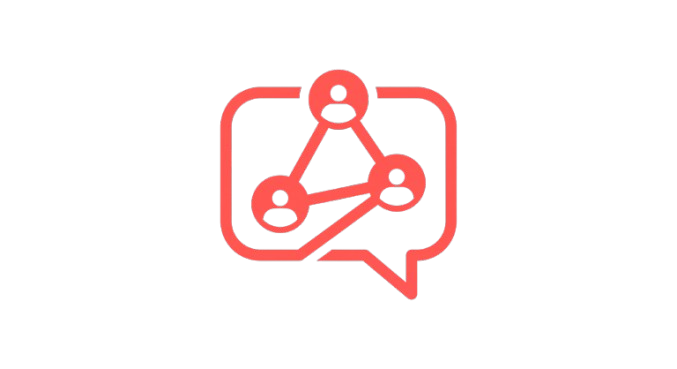

# 🔗 Connected Clone

<p align="center">
  
</p>

O aplicație de chat anonim în timp real, inspirată de Connected2.me. Rulează direct în browser - pe telefon sau desktop - fără instalare complicată.


## ✨ Features

- 💬 **Chat anonim** - Vorbește fără să-ți dezvălui identitatea
- 👤 **Profiluri** - Username, PIN, bio și avatar personalizabil
- 📱 **PWA** - Instalează ca aplicație nativă pe telefon
- 📸 **Stories** - Împărtășește momente care dispar
- 🔔 **Notificări** - Alertă când primești mesaje noi
- 🔒 **Gravatar** - Avataruri generate automat pe baza username-ului

## 🚀 Instalare rapidă

```bash
# Clonează repo-ul
git clone https://github.com/RhadooToma/Connected-Clone.git
cd Connected-Clone

# Instalează dependențele
npm install

# Pornește serverul
node server.js
```

Deschide `http://localhost:3000` în browser sau accesează de pe telefon folosind IP-ul serverului.

## 📱 Instalare PWA pe telefon

1. Deschide aplicația în Chrome/Safari pe telefon
2. Apasă "Adaugă pe ecranul de start"
3. Folosește ca o aplicație nativă!

## 🛠️ Stack tehnic

- **Backend**: Node.js + Express
- **Real-time**: Socket.io (WebSocket)
- **Bază de date**: SQLite3 (fără setup)
- **Frontend**: Vanilla JS + CSS
- **PWA**: Service Worker + Manifest

## 📂 Structură

```
.
├── server.js           # Server Express + Socket.io
├── index.html          # Interfața principală (SPA)
├── sw.js               # Service Worker pentru PWA
├── manifest.json       # Config PWA
├── package.json        # Dependențe Node.js
└── connected2me.db     # Baza de date SQLite (creată automat)
```

## ⚠️ Note

- Aplicația e făcută pentru uz personal/educațional
- Baza de date SQLite e locală - nu e scalabilă pentru producție
- PIN-urile sunt stocate hash-uite (SHA-256)

## 📄 Licență

ISC - Fă ce vrei cu ea, dar pe riscul tău.

---

Made with 🚬 pe un Raspberry Pi 4
